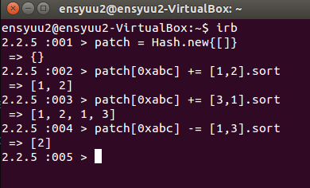

# 課題内容 (パッチパネルの機能拡張)
>パッチパネルに機能を追加しよう。
>
>授業で説明したパッチの追加と削除以外に、以下の機能をパッチパネルに追加してください。
>
>1. ポートのミラーリング
>2. パッチとポートミラーリングの一覧
>
>それぞれ patch_panel のサブコマンドとして実装してください。
>
>なお 1 と 2 以外にも機能を追加した人には、ボーナス点を加点します。                         

---

#解答
##0. 配布されたpatch_panel.rbのバグ修正
[成元君のレポート](https://github.com/handai-trema/patch-panel-r-narimoto/blob/master/report.md#bug)を参考に課題用リポジトリのdevelopブランチの/lib/patch_panel.rbでもともとなされている実装では，パッチを管理するインスタンス変数@patchが正しく動作しないことを確認した．

[図1](https://github.com/handai-trema/patch-panel-d-miura/blob/master/fig_bug.png)に示すように，二次元配列でパッチの情報が管理されていないので，もし，datapath_id=0xabcとなるパッチパネルにport1とport2，port１とport3をつなぐパッチを作成した後に，port1とport3をつなぐパッチのみを削除した場合，@patchはport1とport2をつなぐパッチの情報を保持できていない事がわかる．

##1. ポートのミラーリング
以下のように`パッチパネルのid，モニターポート，ミラーポート`を引数で与えて実行するpatch_panelのサブコマンド`mirror`を実装した．
''$ ./bin/patch_panel mirror dpid monitor_port mirror_port``
###1.1 コード
####1.1.1 /lib/patch_panel.ｒｂへの追記内容
####1.1.1 /bin/patch_panelhへの追記内容
###1.2 動作確認

##2. パッチとポートミラーリングの一覧
以下のように実行するpatch_panelのサブコマンド``list-mirror``として実装した．
###2.1 コード
####2.1.1 /lib/patch_panel．ｒｂへの追記内容
####2.1.1 /bin/patch_panelhへの追記内容
###2.2 動作確認

##3. ポートミラーリングの削除(拡張課題)
拡張課題として追加したポートミラーリングを削除する機能を作成した．
###3.1 コード
####3.1.1 /lib/patch_panel．ｒｂへの追記内容
####3.1.1 /bin/patch_panelhへの追記内容
###3.2 動作確認
